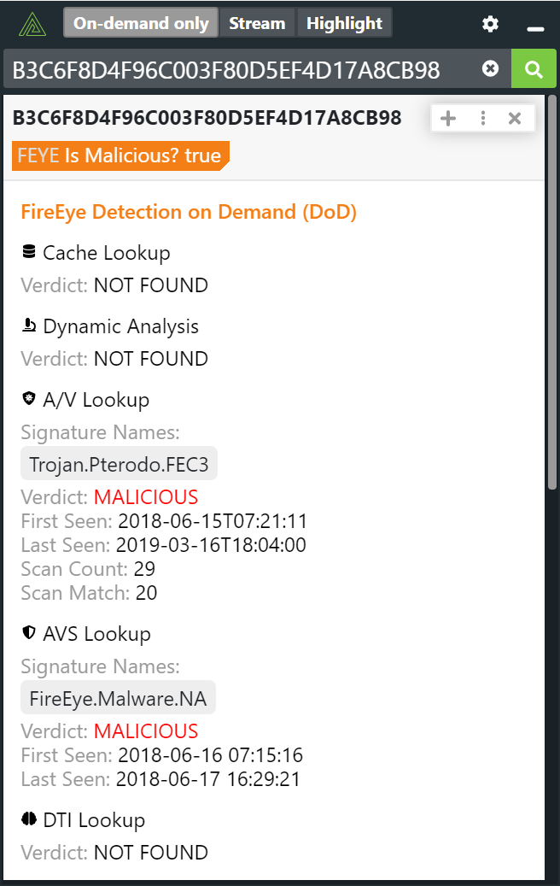

# Polarity Trellix (prev. FireEye) Detection on Demand (DoD) Integration

The Polarity Trellix Detection on Demand (DoD) integration allows Polarity to quickly identify malicious files contained within the Trellix platform.  The Trellix DoD service only supports looking up MD5 hashes.

  

For more information about Trellix's Detection on Demand capability please see: https://fireeye.dev/docs/detection-on-demand/

For information on the Trellix DoD API please see: https://fireeye.dev/apis/
## Installation Instructions

Installation instructions for integrations are provided on the [PolarityIO GitHub Page](https://polarityio.github.io/).

## Polarity

Polarity is a memory-augmentation platform that improves and accelerates analyst decision making.  For more information about the Polarity platform please see:

https://polarity.io/
